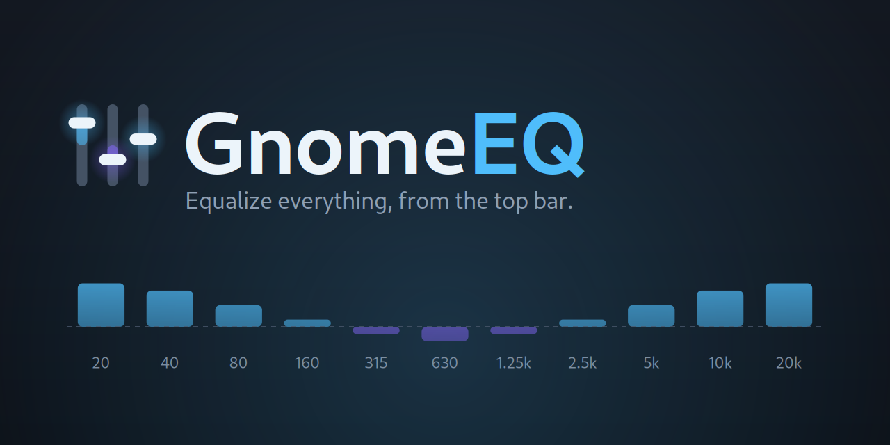
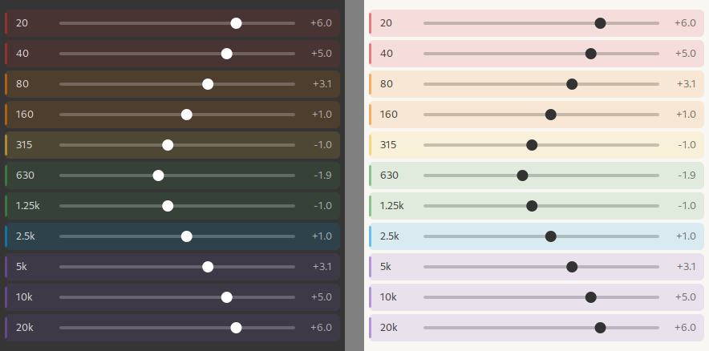

<p align="center">
  
</p>

<p align="center">
  <b>An 11-band graphic equalizer for your whole system, one click away in the top bar.</b><br>
  Equalizes <i>every</i> app — browser, games, VLC, music — by routing the default
  output through a native PipeWire filter chain. Ships tuned presets, saves your
  own, and remembers the one you picked.
</p>

<p align="center">
  
  
  
  
</p>

---

## The band rows

<p align="center">
  
</p>

<p align="center">
  <sub>Rendered by <code>tools/preview_menu.py</code> — an illustration of the
  row layout and frequency-range colours on the dark and light shell themes,
  not a screenshot.</sub>
</p>

## Features

- 🎛️ **Eleven bands spanning the full audible range, 20 Hz → 20 kHz**, ±12 dB each, on the round ISO 266 octave centres. Every band is a peaking filter, so a slider delivers its gain *at the frequency on its label* — verified by measurement, not assumed.
- 🌈 **Colour-coded by ear, not by index** — each slider is tinted by the range it belongs to (sub-bass, bass, lower mids, midrange, upper mids, treble), running warm to cool as frequency rises.
- 🌐 **Everything is equalized** — GnomeEQ becomes the default output, and apps just follow the default. No per-app setup, nothing to configure in Firefox or Steam or VLC.
- ⚡ **Instant, gapless preset switching.** Gains are pushed live into the running filter graph; nothing restarts and audio never drops.
- 🎚️ **Ten presets included** — Flat, Bass Boost, Treble Boost, Vocal Clarity, Loudness, Rock, Electronic, Classical, Podcast, Gaming.
- 💾 **Save your own** from the menu, delete them from Preferences. Your selection is remembered and restored on login.
- 🛡️ **Automatic preamp.** Boosting bands can clip; GnomeEQ cancels the largest boost automatically so it never does. Override it by hand if you prefer.
- 🔌 **Output switching that doesn't bypass the EQ** — pick speakers or HDMI from the menu and the chain follows, instead of silently dropping out of the path.
- 🪶 **No extra process.** The DSP runs inside PipeWire itself; there is no daemon, no autostart entry, and no tray helper.

## How it works

The equalizer is a **PipeWire `filter-chain` virtual sink** — ten `bq_peaking`
biquads and a preamp stage, generated by `tools/gen_sink_conf.py` and served by
your system's own `filter-chain.service`.

The band centres are the **ISO 266 one-octave series**, phase 0:

```
20   40   80   160   315   630 Hz   1.25   2.5   5   10   20 kHz
```

Eleven bands is what it takes to cover 20 Hz to 20 kHz on an octave grid, and
these are the *nominal* preferred values that appear on real hardware — which
is why 315 / 630 / 1250 stand in for the arithmetically exact 320 / 640 / 1280.
ISO rounds them; the worst single step is 27 cents shy of a true octave, and
the geometric mean step is 1.9953 (0.99658 octaves).

**Q = 1.414** is the classic one-octave value, and it matches this spacing to
within 0.36% (`Q = √(2^N)/(2^N − 1)` gives 1.4193 at `N = 0.99658`). Q has to
track the spacing: a wider grid needs a lower Q, and using 1.41 on one would
leave audible gaps between neighbouring bands. This extension is the control
surface: it installs that chain, claims the default sink, and keeps GSettings
and the filter graph in agreement.

One consequence is worth stating plainly: **disabling the extension does not
stop the equalizer.** Audio keeps flowing through the chain with the gains last
set. That is deliberate — an equalizer is part of your audio configuration, not
a property of a panel icon, and tearing down your routing on screen lock or an
extension update would be far more surprising than leaving it alone. To get
back to untouched audio, pick **Flat**, or switch the toggle off.

## Requirements

- GNOME Shell **46–50**
- **PipeWire** (with `filter-chain.service`, which ships enabled on Ubuntu and Fedora) and the `pipewire-bin` tools — `pw-cli`, `pw-dump`, `pw-metadata`, `wpctl`

No plugin packages are needed: the filters are PipeWire builtins.

## Install

```sh
git clone git@github.com:vanvonvan/GnomeEQ.git
cd GnomeEQ

# Compile the schema, generate the filter chain, symlink into the extensions dir:
make link
```

Then restart GNOME Shell so it picks up the new extension, and enable it:

- **Xorg:** `Alt`+`F2`, type `r`, `Enter`.
- **Wayland:** log out and back in (the Shell can't hot-reload under Wayland).

```sh
gnome-extensions enable gnomeeq@vanvonvan.github.io
```

On first enable, GnomeEQ writes its filter chain to
`~/.config/pipewire/filter-chain.conf.d/99-gnomeeq-sink.conf`, restarts
`filter-chain.service` (audio cuts out for about a second), and makes itself
the default output.

## Uninstall

Because the equalizer lives in PipeWire rather than in the extension, removing
the extension is not enough to undo it — the chain keeps running. To revert
completely:

First point your output back at real hardware — either pick the device in
**Settings → Sound → Output**, or find its id with `wpctl status` and run
`wpctl set-default <id>`. Then:

```sh
# 1. Remove the filter chain and restart the daemon that serves it
rm ~/.config/pipewire/filter-chain.conf.d/99-gnomeeq-sink.conf
systemctl --user restart filter-chain.service

# 2. Remove the extension
gnome-extensions disable gnomeeq@vanvonvan.github.io
rm -rf ~/.local/share/gnome-shell/extensions/gnomeeq@vanvonvan.github.io

# 3. Optional: forget the saved presets and settings
dconf reset -f /org/gnome/shell/extensions/gnomeeq/
```

From a clone, `make uninstall` handles step 2.

## Using it

Click the fader icon in the top bar.

| Control | What it does |
| ------- | ------------ |
| **Equalizer** switch | Bypasses the EQ by driving all bands flat. Your curve is kept. |
| **Preset** submenu | Pick a preset. A dot marks the active one; edit any slider and it becomes *Custom*. |
| **Band sliders** | ±12 dB per band, tinted by frequency range. Drag, or focus a row and use `←` / `→` for 1 dB steps. |
| **Pre** | Preamp, ahead of the bands. Automatic by default. |
| **Reset to flat** | Back to no equalization. |
| **Save current as preset…** | Names and stores the current curve. |
| **Output device** | Which physical output the chain feeds. |

Preferences (via the menu's **Settings**) covers engine status, whether to
claim the default output, automatic preamp, hiding the sliders for a compact
menu, and deleting saved presets.

## Troubleshooting

**The extension isn't listed after installing.** GNOME Shell only scans for
extensions at startup, and Wayland cannot hot-reload it. Log out and back in;
`gnome-extensions info gnomeeq@vanvonvan.github.io` will say "doesn't exist"
until you do.

**Audio cut out for a second.** Expected, once: enabling GnomeEQ for the first
time installs the filter chain and restarts `filter-chain.service`. It does not
happen again unless the chain config changes.

**No sound at all.** Check that the chain exists and is reaching your hardware:

```sh
pw-dump | grep -c effect_input.gnomeeq        # 0 means the chain isn't loaded
systemctl --user status filter-chain.service
pw-link -l | grep -A1 '^effect_output.gnomeeq:output_FL'
```

If the chain isn't loaded, use **Reinstall the audio engine** in Preferences.

**It worked, then stopped — after a suspend, a reboot, or a PipeWire restart.**
`filter-chain.service` is `BindsTo=pipewire.service`, so anything that stops
PipeWire stops the chain too, and nothing puts it back on its own: the stop is
clean, so the unit's `Restart=on-failure` never fires, and `BindsTo` propagates
stops but not starts. Because the *configured* default output still names the
GnomeEQ sink, WirePlumber quietly falls back to the hardware — audio keeps
playing, perfectly, with the equalizer no longer in the path. Nothing is logged
and nothing sounds broken until you move a slider and hear no change.

GnomeEQ starts the service itself whenever it finds the sink missing — at login
and each time you open the menu — so this should heal on its own. By hand:

```sh
systemctl --user start filter-chain.service
```

**The sliders do nothing.** Gains are pushed to the graph but cannot be read
back from it, so a silent failure looks like nothing happening. First check
that the chain is actually running (above) — a stopped `filter-chain.service`
is by far the likeliest cause. Then run `make verify` from a clone: it measures
the sink and will tell you whether the DSP is responding. **Stop other audio
first** — `make verify` records whatever is playing through the sink along with
its own probe, so a browser playing in the background makes it report wrong
numbers on a perfectly good chain. It refuses to run and names the app rather
than measuring through it.

**Changing my output in GNOME's menu bypassed the EQ.** That is inherent: apps
follow the default output, so selecting a device there makes *that* device the
default. Use GnomeEQ's own **Output device** submenu instead, which keeps the
chain in the path.

**`wpctl status` lists GnomeEQ under "Filters", not "Sinks".** Normal.
WirePlumber classifies a filter-chain node that way; it is still selectable as
the default output and its volume is controllable
(`wpctl get-volume @DEFAULT_AUDIO_SINK@`).

**The menu is too tall on a small screen.** Opening the preset list or the
output-device list collapses the band sliders to make room. You can also turn
the sliders off entirely in Preferences for a compact, presets-only menu.

## Development

```sh
make test      # headless logic tests (gjs, no shell and no audio needed)
make verify    # prove the DSP by MEASURING it — see below
make conf      # regenerate the PipeWire filter chain
make devkit    # isolated nested GNOME Shell with GnomeEQ enabled
make pack      # build a distributable zip
```

`make verify` is the interesting one. PipeWire reports filter-graph parameters
back as a template of zeros regardless of their live values, so neither
`pw-cli` returning success nor a `pw-dump` read-back tells you whether a gain
actually took effect. The only trustworthy check is to measure the audio, so
`tools/verify_eq.py` creates a null sink, re-links the chain into it (silently),
plays an eleven-tone probe through the equalizer, records the result, and runs
a single-bin DFT at every band centre:

```
band       freq   own gain  verdict
   1      20.0Hz    +12.00       ok
   ...
  11   20000.0Hz    +12.00       ok

Preamp, set to -6 dB (Mult=0.5012) with bands flat:
  mean shift -6.00 dB across all bands (spread 0.00 dB)  ok
```

It restores your original routing when it finishes. Needs `numpy`.

**Nothing else may be playing.** The measurement records the chain's output, so
any app feeding the sink is captured along with the probe — and the result is
not a failure but confident nonsense: a browser playing during the reference
recording reported every band about 5 dB high, and one playing during a single
band's recording reported that band at +2.20 dB, on a chain that measures
+12.00 across the board once the graph is quiet. `verify_eq.py` checks for
streams into the sink first and names them instead of measuring through them.

`make devkit` opens an isolated nested Shell so the menu can be clicked without
logging out. **The window is easy to miss:** `gnome-shell --devkit` is its own
display server (it creates `wayland-1` and never connects to the host's
`wayland-0`), and what you actually see is a separate `mutter-devkit` process —
a viewer onto the nested session's virtual monitor. It has no useful title, so
find it with Alt+Tab and look for *mutter-devkit*. The nested shell shares the
real audio graph, so moving a band in there really does change your sound; its
dconf is isolated, so presets saved in there do not persist.

(`gnome-shell --wayland` is not an alternative on GNOME 50: despite
`--help-all` advertising `--display-server` as "rather than nested", plain
`--wayland` takes the native backend and dies with `Failed to take control of
the session: EBUSY` whenever a compositor already owns the seat.)

`tools/preview_menu.py` renders the slider rows on the light and dark shell
themes side by side. The live shell caches ES modules, so a styling tweak
otherwise costs a full nested-shell restart; this lets a palette be judged in a
second. It is a design aid, not a screenshot of the product.

The branding is reproducible too: `python3 tools/gen_art.py` regenerates the
icon, logo and banner, drawing the bar spectrum from the *actual* Loudness
preset in `lib/constants.js`.

## Layout

The extension itself lives in the UUID-named directory
`gnomeeq@vanvonvan.github.io/`; dev tooling and tests stay at the repo root.

```
gnomeeq@vanvonvan.github.io/   the installable extension (this dir is what ships)
  extension.js        enable/disable, GSettings -> filter graph
  prefs.js            libadwaita preferences (engine, behaviour, presets)
  stylesheet.css      band label/value columns, dimmed-icon state
  metadata.json       extension manifest
  lib/constants.js    band table, ranges, settings keys, preamp maths
  lib/presets.js      preset store (pure functions over a JSON string)
  lib/pipewire.js     the graph bridge: pw-cli / pw-dump / wpctl / pw-metadata
  lib/indicator.js    the panel menu: toggle, presets, sliders, devices
  schemas/            GSettings schema
  data/               the generated filter-chain config the extension installs
  icons/              symbolic panel icon
tests/              headless gjs logic tests (constants, presets)
tools/              gen_sink_conf.py, verify_eq.py, gen_art.py,
                    preview_menu.py, run-devkit.sh
assets/             banner / logo / icon / social preview / row illustration
```

## Credits

- **Built by [Claude](https://claude.com/claude-code)** (Anthropic's Claude Code) — the extension, the filter-chain design, the measurement harness, the artwork and this README were designed and implemented by Claude in collaboration with the repo owner.
- Built with **GJS** on **GNOME Shell**, with **PipeWire** doing the DSP.

## License

Released under the **GNU GPL v2.0 or later**, the standard for GNOME Shell
extensions. See [LICENSE](LICENSE).
